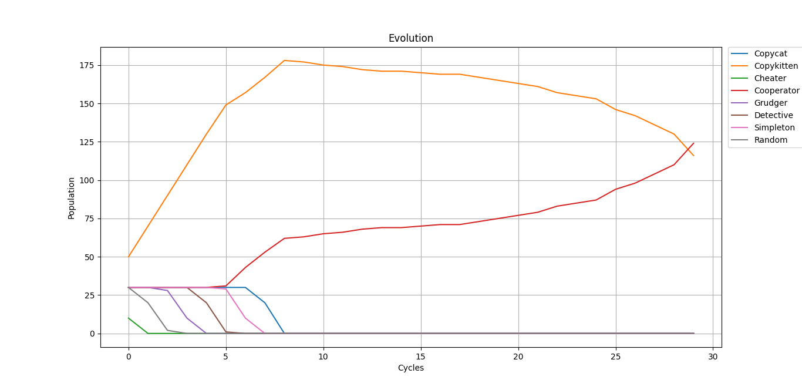

# Trust

Python version of https://github.com/ncase/trust without limits

### Example



Population

Copycat: 30
Copykitten: 30
Cheater: 30
Cooperator: 30
Grudger: 30
Detective: 30
Simpleton: 30
Random: 30

Payoffs

Punishment: 0
Sucker: -2.5
Reward: 5
Temptation: 2.75

Rounds: 30
Cycles: 30
Losers per cycle: 20
Mistake probability: 6

Population after evolution

Copycat: 0
Copykitten: 116
Cheater: 0
Cooperator: 124
Grudger: 0
Detective: 0
Simpleton: 0
Random: 0

### Usage

Download release for [Windows](https://github.com/ilyakotsar/Trust/releases/download/v1.0.0/Trust.exe)

Or use source code:

Install Matplotlib
```
pip install matplotlib
```

Run the script
```
python trust.py
```
