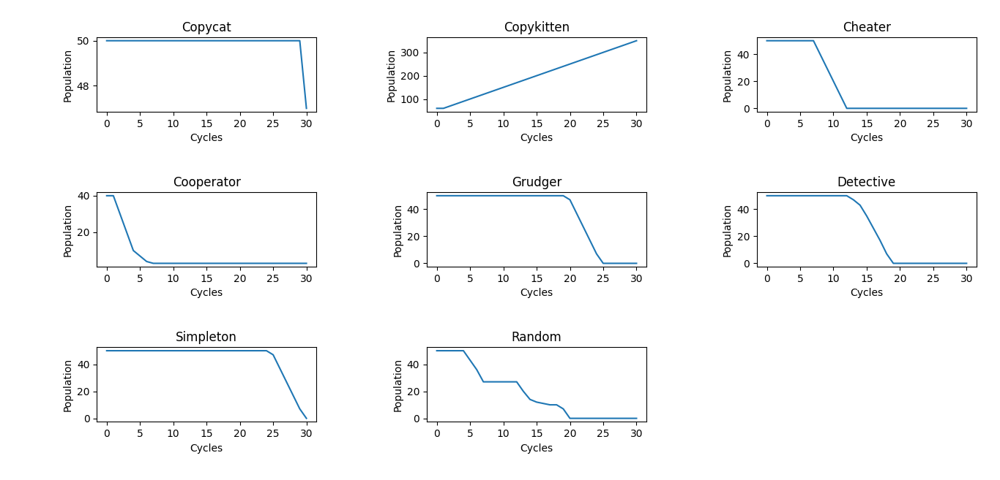

# Trust

Python version of [trust](https://github.com/ncase/trust) without limits

### Example



Population

Copycat: 50
Copykitten: 50
Cheater: 50
Cooperator: 50
Grudger: 50
Detective: 50
Simpleton: 50
Random: 50

Payoffs

Punishment: 0
Temptation: 2
Sucker: -2
Reward: 1.5

Rounds: 30
Cycles: 30
Losers per cycle: 10
Mistake probability: 5

Population after evolution

Copycat: 47
Copykitten: 350
Cheater: 0
Cooperator: 3
Grudger: 0
Detective: 0
Simpleton: 0
Random: 0

### Usage

Install Matplotlib
```
pip install matplotlib
```

Run the script
```
python trust.py
```
